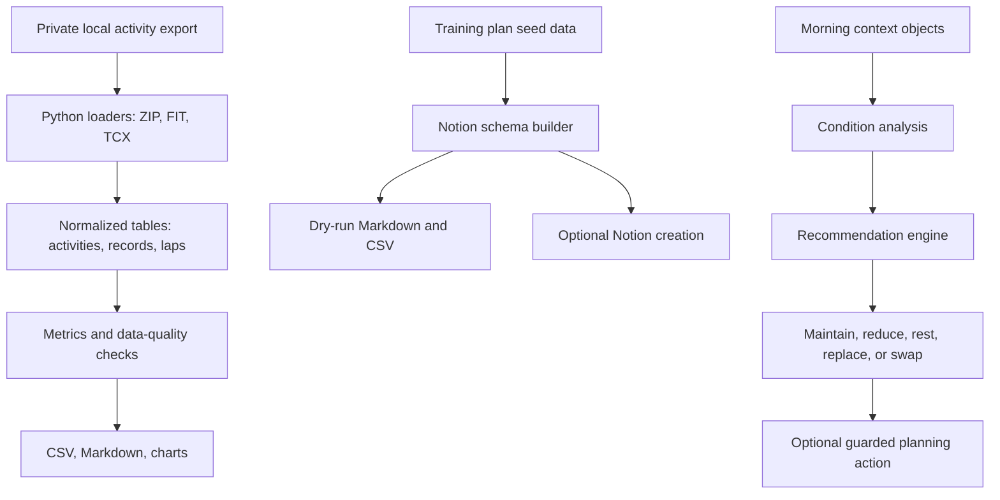

# Architecture

Trail Training Intelligence is a local-first workspace with three related systems. Each system can be understood and tested without publishing private account data.

## Components

| Component | Path | Role | Public-safe surface |
| --- | --- | --- | --- |
| Trail Data Pipeline | `src/trail_data_pipeline/` | Parse activity files, normalize tables, compute trail metrics, render reports | Loaders, normalization, metrics, report code, tests |
| Notion Training Dashboard | `notion-trail-goal-training/` | Generate a structured training dashboard and local dry-run exports | Schemas, seed data, dry-run exporter, tests |
| Morning Training Sync | `runalyze-morning-sync/` | Analyze morning context and decide whether to maintain or adapt the day | Recommendation logic, condition analysis, fixture tests |

## Data Flow

1. The Python pipeline accepts a local ZIP, FIT, TCX, or directory input.
2. Loaders convert vendor-specific fields into `LoadedActivity` objects.
3. Normalization creates stable activity, record, and lap tables.
4. Metrics compute volume, distance, ascent, intensity, long-run structure, back-to-back blocks, estimated load, acute/chronic load ratio, and data-quality indicators.
5. Reporting writes CSV and Markdown artifacts to a caller-chosen output directory.
6. The Notion tool can generate local Markdown/CSV first, then create the dashboard only when credentials and a parent page are supplied.
7. The morning logic consumes local context snapshots and produces a recommendation with reasons and data-quality flags.

## Safety Boundaries

- Raw exports and generated private reports are local-only.
- `.env*`, tokens, cookies, sessions, HAR/MITM captures, output files, and Notion manifests are ignored.
- Public examples are synthetic or anonymized.
- The public repository documents the existence of guarded private adapters without publishing undocumented endpoints, payloads, captured traffic, or account automation instructions.

## Design Choices

- Local-first processing keeps sensitive training data on disk instead of in a hosted service.
- Normalized tables make inconsistent FIT/TCX data testable and reportable.
- Missing values are preserved as data-quality signals instead of causing hard failures.
- Dry-run files make Notion/dashboard changes inspectable before live writes.
- Recommendation outputs include both the decision and the reasons, which makes the automation auditable.
